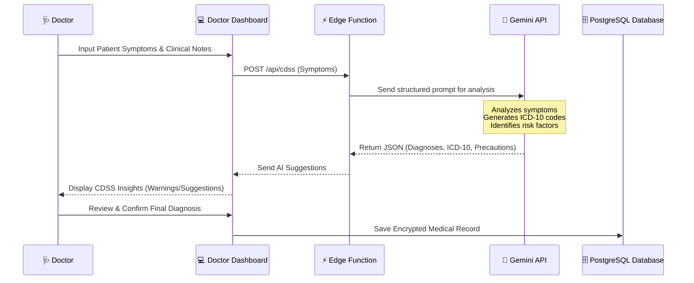

# Tempest — System Architecture

Here is the comprehensive system architecture for the **Tempest Digital Health Records & Surveillance Platform**. This document is designed to provide a deep technical overview of the platform's layers, data flows, and AI integrations, perfect for project evaluation and final submission.

## 1. Master Architecture Diagram (Unified View)

*This singular, comprehensive diagram illustrates the entire Tempest ecosystem—from user interfaces down through the security gateway, into the AI decision support systems, and out through the real-time disease surveillance pipeline.*

```mermaid
flowchart TB
    %% Premium Styling
    classDef frontend fill:#e0f2fe,stroke:#0284c7,stroke-width:2px,color:#0c4a6e,border-radius:8px;
    classDef backend fill:#dcfce7,stroke:#16a34a,stroke-width:2px,color:#14532d,border-radius:8px;
    classDef database fill:#f3e8ff,stroke:#9333ea,stroke-width:2px,color:#581c87,border-radius:8px;
    classDef ai fill:#ffedd5,stroke:#ea580c,stroke-width:2px,color:#7c2d12,border-radius:8px;
    classDef process fill:#fef08a,stroke:#ca8a04,stroke-width:2px,color:#713f12,border-radius:8px;

    %% Client Layer
    subgraph Clients ["💻 Client Applications (React/Vite/Tailwind)"]
        direction LR
        PatientApp["👤 Patient Portal"]:::frontend
        DoctorApp["🩺 Doctor Dashboard<br/>(EHR Input)"]:::frontend
        GovApp["🏛️ Gov Dashboard<br/>(Leaflet Heatmaps)"]:::frontend
        AdminApp["🏥 Org / Admin"]:::frontend
    end

    %% Gateway Layer
    subgraph Gateway ["⚡ Serverless Backend (Supabase)"]
        AuthGateway{"Authentication &<br/>Role Gateway (RLS)"}:::backend
        API["Edge Functions<br/>(Secure API Layer)"]:::backend
    end

    %% Core Data & Pipeline Layer
    subgraph DataStore ["🗄️ Database & Real-Time Surveillance Pipeline"]
        direction TB
        RelationalDB[("PostgreSQL DB<br/>(Encrypted Health Records)")]:::database
        Storage[("Object Storage<br/>(Scans/Reports)")]:::database
        AnonLayer["🛡️ Anonymization Engine<br/>(Strips PII)"]:::process
        RealTimeStream["📊 Real-Time Analytics Stream"]:::process

        RelationalDB -.->|Aggregates & De-identifies| AnonLayer
        AnonLayer -.->|Pushes Metrics| RealTimeStream
    end

    %% External AI
    subgraph AISystem ["🧠 AI Assistant"]
        Gemini["🤖 Google Gemini API<br/>(Clinical Decision Support)"]:::ai
    end

    %% Client Routing
    PatientApp & AdminApp --->|JWT HTTP| AuthGateway
    DoctorApp --->|Submit Symptoms (JWT)| AuthGateway
    GovApp <===|Websocket Stream| RealTimeStream

    %% Gateway to Systems
    AuthGateway ==>|Validates| API
    AuthGateway ==>|Direct RLS Query| RelationalDB
    API ==>|CRUD| RelationalDB
    API ==>|File I/O| Storage

    %% CDSS Link
    API ==>|Prompt & Symptoms| Gemini
    Gemini -.->|ICD-10 & Precautions| DoctorApp
```

## 2. Component Deep-Dives

If you need to break down the system for a presentation, you can use these detailed sub-system views.

### 2.1 🧠 AI Clinical Decision Support (CDSS) Workflow

This sequence demonstrates how Tempest assists doctors with AI-powered diagnostic suggestions in real-time.



## 3. 🌍 Real-Time Disease Surveillance Pipeline

This flowchart shows how individual patient encounters are aggregated securely to power real-time public health monitoring.

```mermaid
flowchart LR
    %% Styling
    classDef input fill:#e0f2fe,stroke:#0284c7,stroke-width:2px,color:#0c4a6e,border-radius:8px;
    classDef process fill:#dcfce7,stroke:#16a34a,stroke-width:2px,color:#14532d,border-radius:8px;
    classDef out fill:#f3e8ff,stroke:#9333ea,stroke-width:2px,color:#581c87,border-radius:8px;

    Node1["🩺 Doctor Finalizes Diagnosis<br/>(Patient X, Disease Y, Location Z)"]:::input
    Node2["🗄️ PostgreSQL Database<br/>(Secure EHR Storage)"]:::process
    Node3["🛡️ Anonymization Layer<br/>(Strips PII, Groups by Region/Disease)"]:::process
    Node4["📊 Real-Time Analytics Engine"]:::process
    Node5["🏛️ Government Dashboard<br/>(Leaflet Heatmaps & Trends)"]:::out

    Node1 -->|Save Record| Node2
    Node2 -->|Trigger / Query| Node3
    Node3 -->|Compute Metrics| Node4
    Node4 -->|WebSocket / API| Node5
```



## 🔒 Security & Privacy Architecture

- **Row-Level Security (RLS):** Supabase RLS policies guarantee that tabular data access is strictly limited based on the JWT claim. A patient can see only their rows; a doctor can see only their patients.
- **Role-Based Access Control (RBAC):** UI routing and API access are heavily gated by roles (`PATIENT`, `DOCTOR`, `ORG_ADMIN`, `SYS_ADMIN`, `GOVERNMENT`).
- **Anonymization Engine:** The government surveillance dashboard operates exclusively on fully anonymized and aggregated diagnostic data, completely stripping out Personally Identifiable Information (PII) to maintain HIPAA/patient privacy compliance.

---
*Built for scale, privacy, and public health resilience.*
